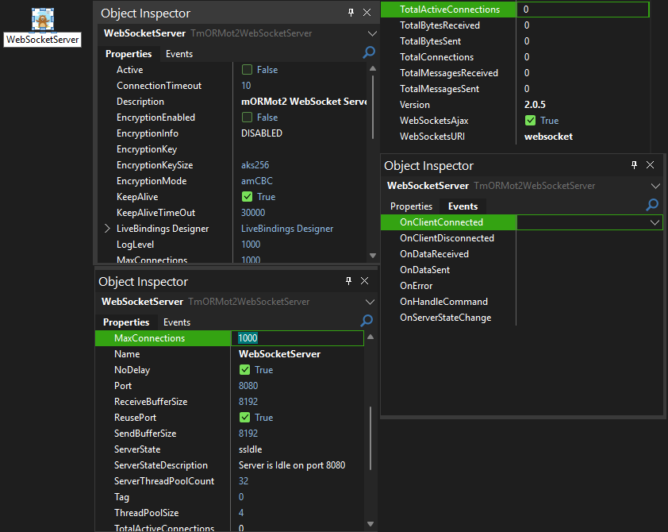
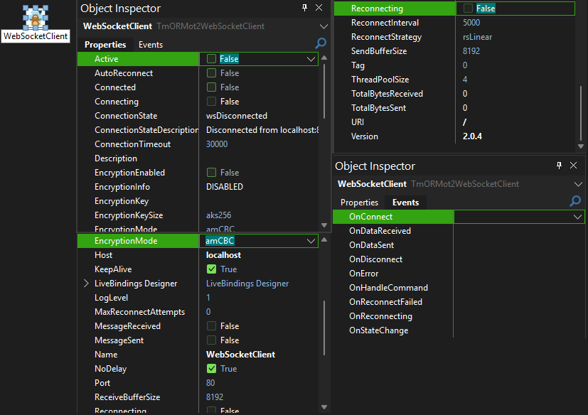

# 🌐 mORMot2 WebSocket Components v2.0.5
**High-Performance Async WebSocket Components for Delphi**

<div align="center">


</div>

---

## 🎬 Component Preview

<div align="center">

### 🖥️ **WebSocket Server Component**


### 💻 **WebSocket Client Component**  


*See the components in action with real-time WebSocket connections, bulletproof encryption, and enterprise-grade performance!*

</div>

---

## ✨ Why Choose mORMot2 WebSocket Components?

### 🎯 **Built for Modern Web**
- **mORMot2's WebSocket Framework**: Leverages the lightning-fast mORMot2 async WebSocket architecture
- **Thousands of Concurrent Connections**: Handle massive WebSocket client loads with ease
- **Standard WebSocket Protocol**: Full RFC 6455 compliance with frame-based communication
- **Real-Time Bidirectional**: Instant push/pull communication between client and server

### 🔧 **Developer-Friendly**
- **Drop-in Components**: Familiar Delphi component architecture with events and properties
- **Thread-Safe Design**: Bulletproof multi-threaded WebSocket operation
- **Smart Auto-Reconnection**: Intelligent reconnection strategies with exponential backoff
- **Coordinated Encryption**: Advanced AES encryption with automatic parameter coordination

### 🛡️ **Enterprise Features**
- **AES Encryption**: Full AES support with automatic mode/key coordination (ECB, CBC, CFB, OFB, CTR, GCM, CFC, OFC, CTC)
- **Connection State Management**: Advanced state tracking and statistics
- **Robust Error Handling**: Comprehensive error propagation and recovery
- **Professional Logging**: Configurable logging levels for debugging and monitoring

---

## 📦 Quick Installation

### 🔨 **3-Step Installation**

1. **Build the Package**
   ```
   Open mORMot2WebSocketComponents.dproj → Build → Install
   ```

2. **Add Library Path**
   ```
   Tools → Options → Library Path → Add source folder path
   ```

3. **Start Building!**
   ```
   Find components in Tool Palette under "mORMot2 WebSocket"
   ```

---

## 🏗️ Components Overview

### 🖥️ **TmORMot2WebSocketServer** - WebSocket Server Component

The powerhouse WebSocket server component that accepts and manages multiple simultaneous WebSocket connections with enterprise-grade performance.

#### 📋 **Key Properties**

| Property | Type | Default | Description |
|----------|------|---------|-------------|
| `Active` | Boolean | False | ⚡ Start/stop the WebSocket server |
| `Port` | Integer | 8080 | 🔌 Server listening port |
| `MaxConnections` | Integer | 1000 | 👥 Maximum concurrent connections |
| `ServerThreadPoolCount` | Integer | 32 | 🧵 Async thread pool size |
| `KeepAliveTimeOut` | Integer | 30000 | ⏱️ Keep-alive timeout (ms) |
| `WebSocketsURI` | String | "websocket" | 🌐 WebSocket endpoint URI |
| `WebSocketsAjax` | Boolean | True | 📡 Enable AJAX fallback |
| `EncryptionEnabled` | Boolean | False | 🔐 Enable AES encryption |
| `EncryptionKey` | String | "" | 🔑 AES encryption key |
| `EncryptionMode` | TAESMode | amCBC | 🛡️ AES encryption mode |
| `EncryptionKeySize` | TAESKeySize | aks256 | 🔒 Key size (128/192/256) |

#### 📊 **Statistics Properties (Read-Only)**

| Property | Type | Description |
|----------|------|-------------|
| `ClientCount` | Integer | 👥 Current active connections |
| `TotalConnections` | Int64 | 📈 Total connections since start |
| `TotalActiveConnections` | Int64 | 🔴 Live connection count |
| `TotalBytesReceived` | Int64 | 📥 Total bytes received |
| `TotalBytesSent` | Int64 | 📤 Total bytes sent |
| `TotalMessagesReceived` | Int64 | 📨 Total messages received |
| `TotalMessagesSent` | Int64 | 📤 Total messages sent |

#### 🎪 **Events**

| Event | Description |
|-------|-------------|
| `OnClientConnected` | 🎉 WebSocket client connected |
| `OnClientDisconnected` | 👋 WebSocket client disconnected |
| `OnDataReceived` | 📨 Process incoming WebSocket data |
| `OnDataSent` | 📤 WebSocket data transmission complete |
| `OnHandleCommand` | 📋 Handle WebSocket commands |
| `OnError` | ❌ Error occurred |
| `OnServerStateChange` | 🔄 Server state changed |

---

### 💻 **TmORMot2WebSocketClient** - WebSocket Client Component

The intelligent WebSocket client component with bulletproof auto-reconnection and smart connection strategies.

#### 📋 **Key Properties**

| Property | Type | Default | Description |
|----------|------|---------|-------------|
| `Active` | Boolean | False | ⚡ Connect/disconnect |
| `Host` | String | "localhost" | 🌐 Server hostname/IP |
| `Port` | Integer | 80 | 🔌 Server port |
| `URI` | String | "/" | 🌐 WebSocket URI path |
| `Connected` | Boolean | False | 🔗 Connection state |
| `ConnectionTimeout` | Integer | 30000 | ⏱️ Connection timeout (ms) |
| `AutoReconnect` | Boolean | False | 🔄 Enable auto-reconnection |
| `ReconnectStrategy` | TWebSocketReconnectStrategy | rsLinear | 📈 Reconnection strategy |
| `ReconnectInterval` | Integer | 5000 | ⏰ Base reconnection interval (ms) |
| `MaxReconnectAttempts` | Integer | 0 | 🔢 Maximum reconnection attempts |

#### 🔄 **Reconnection Strategies**

| Strategy | Description |
|----------|-------------|
| `rsLinear` | ⏰ Fixed interval reconnection |
| `rsExponential` | 📈 Exponential backoff (smart) |

#### 📊 **Statistics Properties (Read-Only)**

| Property | Type | Description |
|----------|------|-------------|
| `ConnectionState` | TWebSocketConnectionState | 🔄 Current connection state |
| `ConnectionStateDescription` | String | 📝 Human-readable state |
| `TotalBytesReceived` | Int64 | 📥 Total bytes received |
| `TotalBytesSent` | Int64 | 📤 Total bytes sent |
| `Reconnecting` | Boolean | 🔄 Currently reconnecting |

#### 🎪 **Events**

| Event | Description |
|-------|-------------|
| `OnConnect` | 🎉 Connected to WebSocket server |
| `OnDisconnect` | 👋 Disconnected from server |
| `OnDataReceived` | 📨 Process incoming WebSocket data |
| `OnDataSent` | 📤 WebSocket data sent |
| `OnHandleCommand` | 📋 Handle WebSocket commands |
| `OnError` | ❌ Error occurred |
| `OnStateChange` | 🔄 Connection state changed |
| `OnReconnecting` | 🔄 Attempting reconnection |
| `OnReconnectFailed` | ❌ Reconnection attempt failed |

---

## 🚀 Quick Start Examples

### 🖥️ **Start WebSocket Server**

```pascal
// Start server
procedure TServerForm.StartServer;
begin
  mORMot2WebSocketServer1.Port := 8080;
  mORMot2WebSocketServer1.Active := True;
end;
```

### 🔌 **Stop WebSocket Server**

```pascal
// Stop server
procedure TServerForm.StopServer;
begin
  mORMot2WebSocketServer1.Active := False;
end;
```

### 💻 **Connect WebSocket Client**

```pascal
// Connect to server
procedure TClientForm.ConnectToServer;
begin
  mORMot2WebSocketClient1.Host := '127.0.0.1';
  mORMot2WebSocketClient1.Port := 8080;
  mORMot2WebSocketClient1.Connect;
end;
```

### 🔌 **Disconnect WebSocket Client**

```pascal
// Disconnect from server
procedure TClientForm.DisconnectFromServer;
begin
  mORMot2WebSocketClient1.Disconnect;
end;
```

### 📤 **Send Data Server to Client**

```pascal
// Send to specific client
procedure TServerForm.SendToClient(ClientID: Integer);
var
  Data: TBytes;
begin
  Data := BytesOf('Hello Client!');
  mORMot2WebSocketServer1.SendCommandToClient(ClientID, Data);
end;
```

### 📤 **Send Data Client to Server**

```pascal
// Send to server
procedure TClientForm.SendToServer;
var
  Data: TBytes;
begin
  Data := BytesOf('Hello Server!');
  mORMot2WebSocketClient1.SendCommand(Data);
end;
```

---

## 📡 Broadcasting Examples

### 📢 **Broadcast to All Clients**

```pascal
// Broadcast message to all connected clients
procedure TServerForm.BroadcastToAll;
var
  Data: TBytes;
begin
  Data := BytesOf('Message for everyone!');
  mORMot2WebSocketServer1.BroadcastCommand(Data);
end;
```

### 👥 **Loop Through All Clients**

```pascal
// Get client information (implement via tracking)
procedure TServerForm.ShowAllClients;
begin
  // Total client count
  ShowMessage(Format('Total clients: %d', [mORMot2WebSocketServer1.GetClientCount]));
  
  // Client IP example
  ShowMessage(mORMot2WebSocketServer1.GetClientIP(ClientID));
end;
```

---

## 🔐 Encryption Examples

### 🛡️ **Server Encryption Setup**

```pascal
// Configure server encryption
procedure TServerForm.SetupEncryption;
begin
  mORMot2WebSocketServer1.EncryptionEnabled := True;
  mORMot2WebSocketServer1.EncryptionKey := 'MySecretKey123!';
  
  // Set encryption mode (fully qualified)
  mORMot2WebSocketServer1.EncryptionMode := mormot2.WebSocket.Server.TAESMode(amCBC);
  
  // Set key size (fully qualified)
  mORMot2WebSocketServer1.EncryptionKeySize := mormot2.WebSocket.Server.TAESKeySize(aks256);
end;
```

### 🔑 **Client Encryption Setup**

```pascal
// Configure client encryption (must match server)
procedure TClientForm.SetupEncryption;
begin
  mORMot2WebSocketClient1.EncryptionEnabled := True;
  mORMot2WebSocketClient1.EncryptionKey := 'MySecretKey123!';
  
  // Set encryption mode (fully qualified)
  mORMot2WebSocketClient1.EncryptionMode := mormot2.WebSocket.Client.TAESMode(amCBC);
  
  // Set key size (fully qualified)  
  mORMot2WebSocketClient1.EncryptionKeySize := mormot2.WebSocket.Client.TAESKeySize(aks256);
end;
```

### 🔒 **Encryption Mode Examples**

```pascal
// Different encryption modes (Server)
mORMot2WebSocketServer1.EncryptionMode := mormot2.WebSocket.Server.TAESMode(amCBC);  // Default
mORMot2WebSocketServer1.EncryptionMode := mormot2.WebSocket.Server.TAESMode(amCFB);  // Stream
mORMot2WebSocketServer1.EncryptionMode := mormot2.WebSocket.Server.TAESMode(amGCM);  // Authenticated

// Different key sizes (Server)
mORMot2WebSocketServer1.EncryptionKeySize := mormot2.WebSocket.Server.TAESKeySize(aks128);  // 128-bit
mORMot2WebSocketServer1.EncryptionKeySize := mormot2.WebSocket.Server.TAESKeySize(aks192);  // 192-bit
mORMot2WebSocketServer1.EncryptionKeySize := mormot2.WebSocket.Server.TAESKeySize(aks256);  // 256-bit
```

---

## 📨 Event Handling Examples

### 🎪 **Server Events**

```pascal
// Handle client connections
procedure TServerForm.mORMot2WebSocketServer1ClientConnected(Sender: TObject; 
  ClientID: Integer);
begin
  ShowMessage(Format('Client %d connected', [ClientID]));
end;

// Handle incoming data
procedure TServerForm.mORMot2WebSocketServer1DataReceived(Sender: TObject; 
  ClientID: Integer; const Data: TBytes);
var
  Message: string;
begin
  Message := StringOf(Data);
  ShowMessage(Format('Received from client %d: %s', [ClientID, Message]));
end;
```

### 🎪 **Client Events**

```pascal
// Handle connection
procedure TClientForm.mORMot2WebSocketClient1Connect(Sender: TObject);
begin
  ShowMessage('Connected to server!');
end;

// Handle incoming data
procedure TClientForm.mORMot2WebSocketClient1DataReceived(Sender: TObject; 
  const Data: TBytes);
var
  Message: string;
begin
  Message := StringOf(Data);
  ShowMessage('Received: ' + Message);
end;
```

---

## 🛠️ WebSocket Protocol Details

### 📦 **Message Structure with Encryption Coordination**

```
+----------------+----------------+---------------+------------------+
| Magic (4 bytes)| Mode (4 bytes) | KeySize (4)   | Reserved (4)     |
+----------------+----------------+---------------+------------------+
| 0x4D4F524D     | AES Mode       | AES Key Size  | Future Use       |
+----------------+----------------+---------------+------------------+
|                    Encrypted WebSocket Data                      |
+------------------------------------------------------------------+
```

### 🔐 **Encryption Modes Available**

| Mode | Description | Use Case |
|------|-------------|----------|
| `amECB` | Electronic Codebook | Simple, fast |
| `amCBC` | Cipher Block Chaining | **Default, secure** |
| `amCFB` | Cipher Feedback | Stream-like |
| `amOFB` | Output Feedback | Stream cipher |
| `amCTR` | Counter Mode | Parallel processing |
| `amGCM` | Galois/Counter Mode | Authenticated encryption |
| `amCFC` | CFC Mode | Advanced |
| `amOFC` | OFC Mode | Advanced |
| `amCTC` | CTC Mode | Advanced |

---

## 🎪 Complete Working Example

### 🖥️ **Simple WebSocket Echo Server**

```pascal
unit WebSocketServerForm;

interface

uses
  System.Classes, Vcl.Forms, Vcl.StdCtrls,
  mORMot2.WebSocket.Server;

type
  TForm1 = class(TForm)
    mORMot2WebSocketServer1: TmORMot2WebSocketServer;
    ButtonStart: TButton;
    ButtonStop: TButton;
    Memo1: TMemo;
    
    procedure ButtonStartClick(Sender: TObject);
    procedure ButtonStopClick(Sender: TObject);
    procedure mORMot2WebSocketServer1DataReceived(Sender: TObject; 
      ClientID: Integer; const Data: TBytes);
  end;

implementation

procedure TForm1.ButtonStartClick(Sender: TObject);
begin
  mORMot2WebSocketServer1.Port := 8080;
  mORMot2WebSocketServer1.Active := True;
  Memo1.Lines.Add('Server started');
end;

procedure TForm1.ButtonStopClick(Sender: TObject);
begin
  mORMot2WebSocketServer1.Active := False;
  Memo1.Lines.Add('Server stopped');
end;

procedure TForm1.mORMot2WebSocketServer1DataReceived(Sender: TObject; 
  ClientID: Integer; const Data: TBytes);
var
  Message: string;
  Response: TBytes;
begin
  Message := StringOf(Data);
  Response := BytesOf('Echo: ' + Message);
  mORMot2WebSocketServer1.SendCommandToClient(ClientID, Response);
end;

end.
```

---

## 🏆 Performance & Compatibility

### ⚡ **Performance Specs**
- **Concurrent Connections**: 1000+ simultaneous WebSocket clients
- **Real-Time Communication**: Ultra-low latency WebSocket frames
- **Memory Usage**: Efficient memory management with async connection pooling
- **CPU Usage**: Multi-threaded async WebSocket architecture for maximum performance

### 🔧 **Compatibility**
- **Delphi Versions**: XE2, XE3, XE4, XE5, XE6, XE7, XE8, 10 Seattle, 10.1 Berlin, 10.2 Tokyo, 10.3 Rio, 10.4 Sydney, 11 Alexandria, 12 Athens, 12.2
- **Platforms**: Windows 32-bit & 64-bit
- **Frameworks**: VCL, Console applications
- **Dependencies**: mORMot2 framework (included)

### 📋 **Requirements**
- ✅ mORMot2 framework properly installed
- ✅ Windows platform (32/64-bit)
- ✅ Delphi XE2 or later

---

## 🎯 **Why v2.0.5 is Special**

### 🛡️ **BULLETPROOF WebSocket Features**
- **Coordinated Encryption**: Revolutionary encryption parameter coordination between client/server
- **Smart State Management**: Comprehensive WebSocket connection state tracking
- **Bulletproof Reconnection**: Exponential backoff strategies for network interruptions
- **Memory Leak Prevention**: Advanced cleanup procedures prevent WebSocket resource leaks
- **Thread-Safe Operations**: All WebSocket operations properly synchronized for multi-threaded safety

### 🆕 **Version 2.0.5 Improvements**
- ✅ Fixed encryption coordination with automatic parameter validation
- ✅ Enhanced WebSocket reconnection with exponential backoff
- ✅ Bulletproof WebSocket client disconnect handling
- ✅ Advanced connection state management with human-readable descriptions
- ✅ Improved error handling and WebSocket event management
- ✅ Enhanced encryption context management with salt coordination (Just a hardcoded Salt on both client/server) May enhance the way we generate these salts in the future!

---

## 📞 **Support & Community**

### 💬 **Get Help**
- **Issues**: Report bugs via GitHub Issues
- **Questions**: Community support available
- **Contributing**: Pull requests welcome!
- **Discord**: bitmasterxor

### 📜 **License**
**Open Source** - Free to distribute and use in commercial and personal projects!

---

<div align="center">

**🌐 Ready to Build High-Performance WebSocket Applications?**

*Download • Install • Build Amazing Real-Time Apps!*

**Made By BitmasterXor And Friends With ❤️ for the Delphi Community**

</div>
